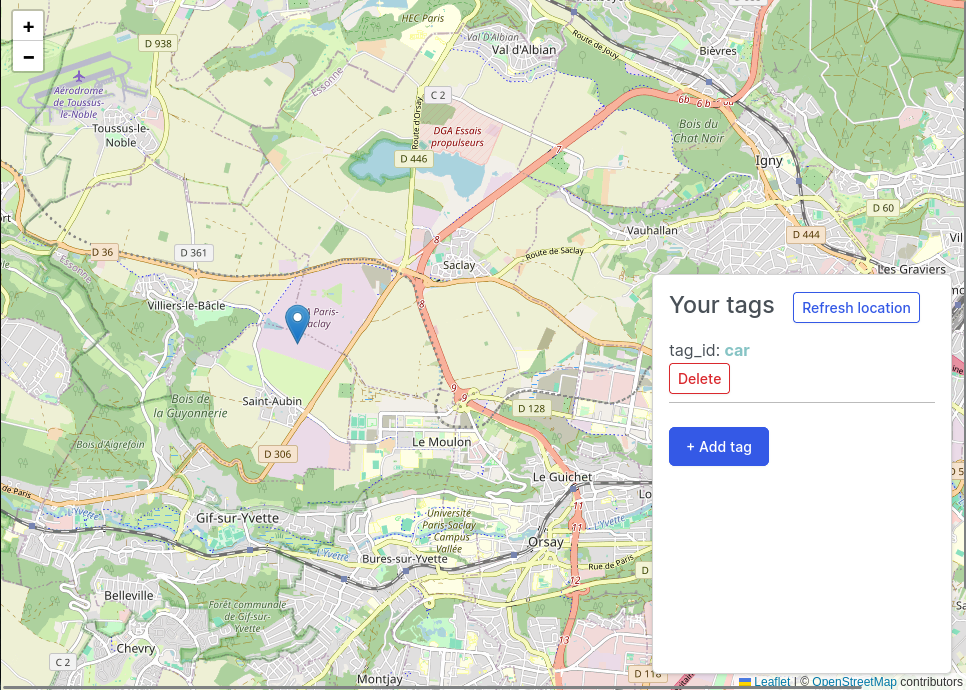

# FindMy Server

Query Apple's Find My network, based on all the hard work of https://github.com/seemoo-lab/openhaystack/ and @hatomist and @JJTech0130 and @Dadoum.

This is implementation if https://github.com/biemster/FindMy using a flask web server. The idea is to expose the service (in a local network) and use the data in another service. For example, you can use services like home assistant or traccar to call this server via a REST API, then retrieve the reported location and save it on the service.

> **WARNING**: do NOT expose this server to the public network. This service is meant to be used as a local docker service.

## Installation

It's recommended to create a icloud burner account (i.e. with a disposable email). This way, you remand anonymous, while prevent apple from blocking for main account.

**Make sure you have docker installed on your machine**

1. Clone this repository
2. Run `docker compose up -d`
3. Run `docker exec -it findmy_server bash -c "cd /app && python setup.py"`
4. Enter your icloud credentials

## Web UI

The project provides an **exprimental** web UI for testing the functions. Please not that it is not ready to be on production. Instead, you should use the API endpoints to connect with outside services.

The Web UI can be accessed via `http://localhost:3033`

TODO:
- Add "export" and "edit" buttons
- Auto zoom map
- Show last update / list of all positions



## API endpoints

The service can be accessed from `http://localhost:3033`

### POST /generate_key

This endpoint generates a new key pair that can be used to deploy to a device (for example, ESP32)

Note:
- Deploy the `adv_key` to the device
- `ctype_byte_arr` is purely for convenient, in case you want to deploy using Arduino IDE. You don't need to save this field, it is actually a copy of `adv_key`.
- `tag_id` is for internal usage (for example, tag a device on home assistant). You can modify it to whatever you want.

No need request body

Response body (example)

```
{
    "adv_hash": "UeBXkttdj5u6NG87P0hU+PPjZLOAWuBn1NFQoigc5yU=",
    "adv_key": "7oOwMvXN0jUcRnP8Mw1qwcRFuEq1n+AMAswOfA==",
    "ctype_byte_arr": "0xee, 0x83, 0xb0, 0x32, 0xf5, 0xcd, 0xd2, 0x35, 0x1c, 0x46, 0x73, 0xfc, 0x33, 0x0d, 0x6a, 0xc1, 0xc4, 0x45, 0xb8, 0x4a, 0xb5, 0x9f, 0xe0, 0x0c, 0x02, 0xcc, 0x0e, 0x7c",
    "priv_key": "60w1D2jebO4orxYgWeH9k9kSsbI0LF/6bz9V0g==",
    "tag_id": "458cca9449bb3a59"
}
```

### POST /get_locations

This endpoint fetch the data from icloud server, decode it and return as an array.

Note:
- `hours` is optional, default to `24` (meaning get all reports in the last 24 hours)
- `ctype_byte_arr` field is optional, the server do not use it.

Request body (example)

```
{
    "keys": [
        {
            "adv_hash": "UeBXkttdj5u6NG87P0hU+PPjZLOAWuBn1NFQoigc5yU=",
            "adv_key": "7oOwMvXN0jUcRnP8Mw1qwcRFuEq1n+AMAswOfA==",
            "priv_key": "60w1D2jebO4orxYgWeH9k9kSsbI0LF/6bz9V0g==",
            "tag_id": "458cca9449bb3a59"
        }
    ],
    "hours": 48
}
```

Response body (example)

```
{
    "results": [
        {
            "isodatetime": "2023-12-28T15:27:19",
            "lat": 48.11111,
            "lon": 2.11111,
            "tag_id": "458cca9449bb3a59",
            "timestamp": 1703777239
        },
        {
            "isodatetime": "2023-12-28T15:05:09",
            "lat": 48.11111,
            "lon": 2.11111,
            "tag_id": "458cca9449bb3a59",
            "timestamp": 1703775909
        },
        ...
        ...
        ...
    ]
}
```
